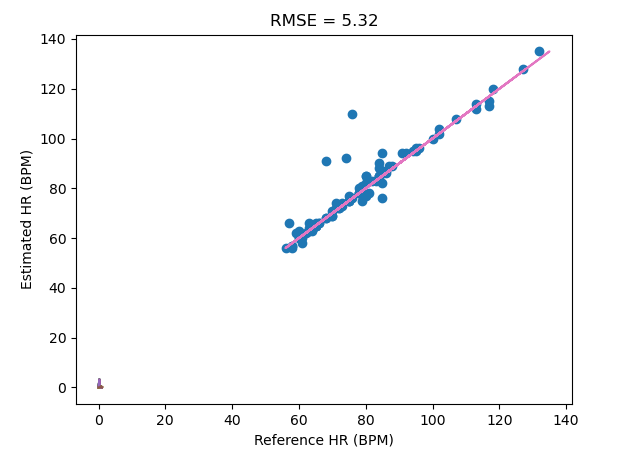

Ihyun Park A16605545
William Lynch A14588777

Tutorial 1:

In this tutorial, we learned how to prepare our dataset for training and testing. Initially, we learned how to import a large amount of data into our environment using glob and a specific naming convenion for files we want to read. Then after reading the data, we were able to extract the subjects from the title of the file. Using the information we extracted from the title, we calculated the time and estimated the FS and heart rate and filtered and plotted them like we did for our individual data in our last tutorial of lab 6.

Tutorial 2:

In this tutorial, we actually trained the data that we collected and validated it using Leave-One-Subject-Out-Validation or LOSOV for short. First, we loaded the data in as same as tutorial 1, then calculated the weight, mu and variance using the gmm function in sklearn. Then, we plotted the Gaussian probability density function using the norm function is scipy and compared it with the gmm to verify that the histogram looks correct. With the trained model, we look to estimate the heartrate using the model, by using np.diff in order to see where the data crosses from 0 to 1 or 1 to 0, since they represent the peaks. If we see where the output is equal to 1 after using np.diff, we can tell where the peaks are, and calculating over the time that we calculated in tutorial 1, we can estimate the bpm. We can plot the detected peaks over the filtered ppg data to see if our output is accurate. Now, we can validate our model using the LOSOV. Here we gathered all the data for all the subjects except for one subject in sequential order. Then we we process all of the data and appened it to the training vector, train it using the GMM method from earlier, then predict the labels for the excluded subject using the model and compute the esimated heart rate. If we do this excluding all of the subject once at a time, we would have estimated heart rate for all of the data.

Challenge 1:

|  |

RMSE:  5.106640556939345  Correlation:  0.9559554253211457  R2 Score:  0.9040537004938353  Explained Variance Score:  0.9083275192319572

We had an RMSE value of around 5.3, and this value is lower the better. We believe this value is like this due to some of the data that has severely outlying estimated data points that when subtracted from its ground truth value, causes a significant shift in the value of RMSE. With all of the data the RMSE value was as high as around 20, but deleting all of the data with severe noise, we were able to reduce this value down to 5.

The second metric we decided to use was the Correlation coefficient, since it tells us how closely related the estimated value is to the ground truth value. This value is higher the value, since estimation is better the more related it is to the reference values. For this we got a relatively high value of 0.95, which tells us that our model is pretty decent.

The third metric we decided to use was the R2 score, since it tells us how close the data is to the best fit line. The closer the value to 1.0, the better it is. Our best fit line would of course be a graph of our ground truth values vs ground truth values, which we graphed in the plot. Aside from a couple outliers, we can see that the best fit line goes through most of the data points, which supports our R2 score of around 0.9, a relatively high value, representing a pretty accurate estimation.

The final metric we decided to use was the Variance Score, which is basically the same as the r2 score, except it takes the mean error into the calculation. Simialrly, the closer the score is to 1.0, the better it is. To get the explained variance score, we subtract the mean error from the R2 score. If there is a significant or noticeable mean error value, meaning Explain variance score noticeably differs from the R2 value, it means we have bias in the error in our data, and we can see from the very similar value, that we have little bias in the error in our data.

Challenge 2:

https://www.youtube.com/shorts/Fja0dzJCiVc

For our challenge 2, we simply added a new method in our hrmonitor class that when called, calls the various functions we defined in tutorial 2 in order to train the model using all of the data, except here, we don't use LOSOV to exclude one subject. Then this method return the trained model into our python code, which then passes that model into our predict method along with our fs every second. Then we add all of the data that we obtain from the MCU to our ppg circular list along with the time exactly like we did in Lab_6. Then in the HRMonitor class, it uses the ppg and time values that was added to the class and uses it to predict the heartrate, by first converting the circularlist of ppg's into an numpy array, passing that into the process function to process and filter it, predicting the labels after reshaping it, and then finally using the estimate_hr function to predict. Then that method returns the estimated heart rate, which the python code sends to the MCU for it to display.

Challenge 3:

https://www.youtube.com/watch?v=JJ9Z3zzNju8

For our challenge 3, we implemented all of the previous challenges into this one wearable. We created a button that switches between the information of the pedometer,heart rate monitor and a watch. As you can see, at first it initially goes from a watch, then to the heart rate monitor. However, when we press the button again to go to the pedometer, it doesn't update the step count, even though we can see in the terminal that the correct data is being communicated between the MCU and our code. We coud not debug this issue, but given some more time, I believe this would be an easy fix. Our motor was also broken, but the arduino code shows that the motor would buzz whenever the button is pressed. The OLED displays all of the information, buzzer motor indicates when the state is being changed, accelerometer is being used for the pedometer, photodetector for the heart rate, and the button for actually changing the states. We change states by implementing a state machine with the MCU code.  Whenever we press the button we increment to a new state and send a message to the python serial that we have changed states. The python serial then switches to only computing the information for the state requested.  This saves a lot of memory and energy only having one state rendered at a time.

Disclaimer:

Sorry for some late submissions on this assignment. We did not want to leave it unfinished.  We had tremendous issues with the python serial side of things.  My windows antivirus had removed files within my python installation and was preventing me from using pip to install my custom packages.  After resolving this problem there was new dependency problems within my interpretor and virtual environment. After all this I ended up using a new IDE in my linux virtual machine to complete the assignment.  This lateness was not at all due to a lack of trying or bad time management, it truly was because of unforseen problems with my OS and I hope you can afford me some points for that problem.  Thank you for the great quarter, this class has taught me more than almost any other class I have taken my whole 5 years here.  It has given me way more confidence in my ability to create and make things.  